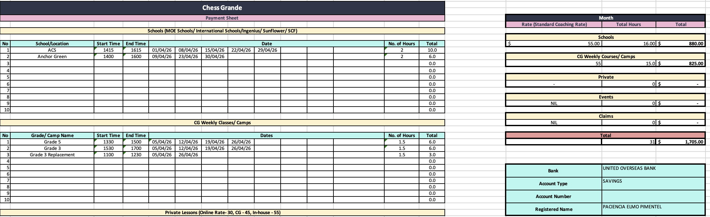
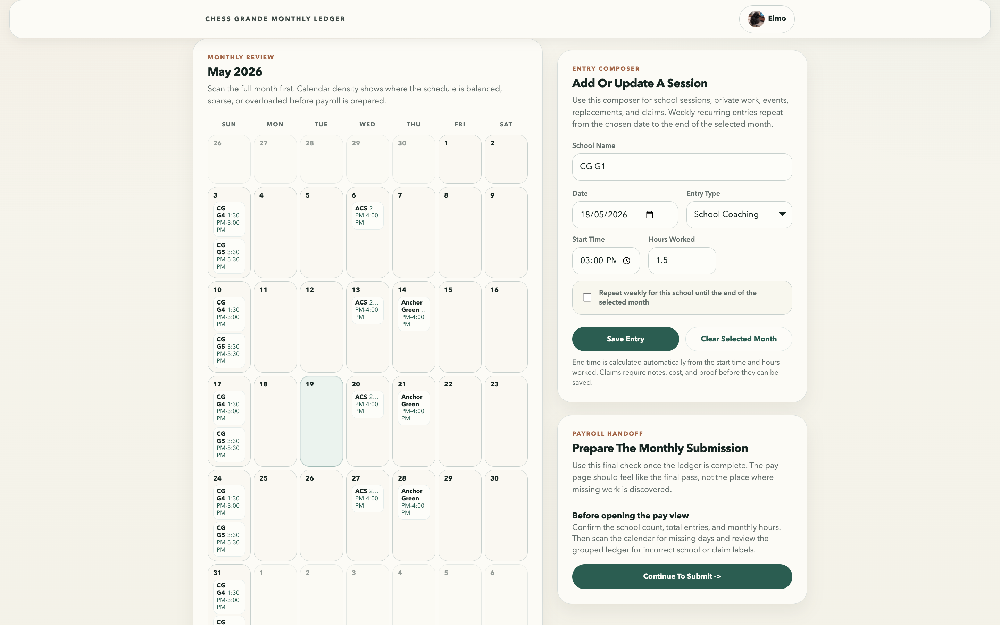
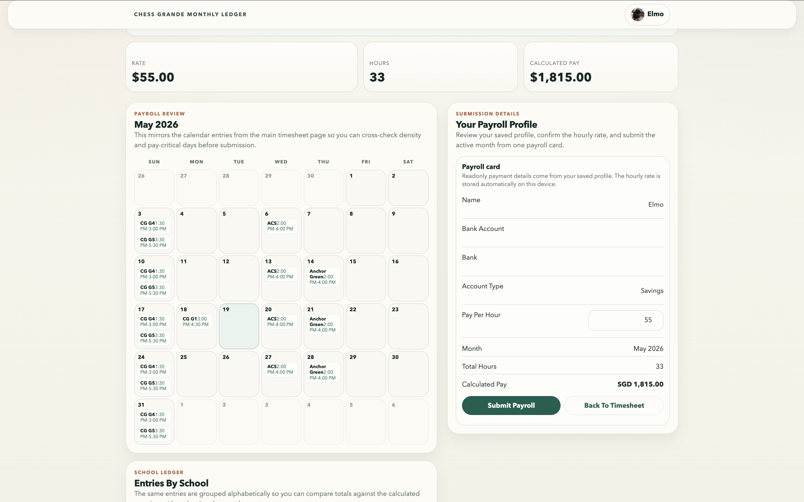
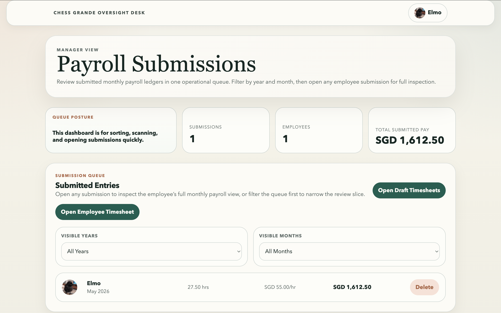
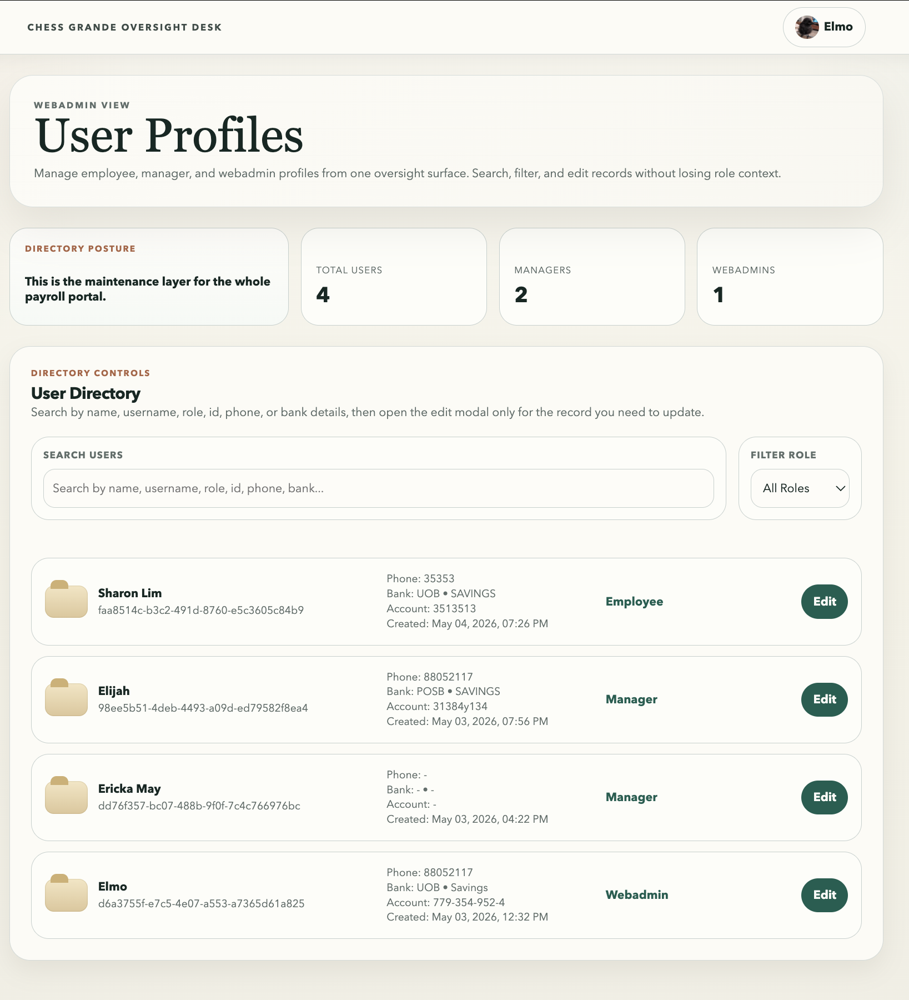

# Chess Grande Payroll Portal

A static web payroll portal for Chess Grande employees, managers, and webadmins, replacing a manual monthly Excel timesheet with a clearer browser-based workflow.

> Screenshots use curated demo data for GitHub. No real payroll, bank, or user records are shown.

## Before And After

The original workflow was a spreadsheet-first payment sheet: staff filled repeated rows, dates, time blocks, claims, and replacements manually before payroll review. This project turns that into a role-based web app backed by Supabase, with draft entries, monthly pay review, manager oversight, and webadmin profile management.

<table>
  <tr>
    <th>Before: manual Excel payment sheet</th>
    <th>After: guided web timesheet</th>
  </tr>
  <tr>
    <td></td>
    <td></td>
  </tr>
</table>

## Why This Exists

The Excel version worked, but it made payroll depend on careful manual entry across many repeated date columns and category sections. It was easy for staff to miss a session, duplicate a date, or separate claim proof from the payroll line it belonged to.

The web app keeps the familiar monthly ledger idea, but gives each role a focused workflow:

- Employees add coaching sessions, replacements, private work, events, camps, and claims.
- The monthly pay page calculates hours and pay from the same draft ledger.
- Managers review submitted payroll snapshots and inspect employee entries.
- Webadmins maintain user profiles, account roles, and operational details.

## How The Web App Is Used

### 1. Employees Build The Monthly Timesheet

Employees work from one monthly view. The calendar shows schedule density, while the school ledger groups entries for review before submission.


### 2. Employees Review And Submit Pay

The pay view mirrors the same entries through a payroll lens: saved profile details, hourly rate, total hours, and calculated pay stay together before submission.



### 3. Managers Review Submitted Payroll

Managers get an operational queue for submitted monthly payroll. They can filter by month/year, scan totals, and open an employee submission for deeper review.



### 4. Webadmins Manage Users And Roles

Webadmins manage the user directory from one maintenance screen, including role context for employees, managers, and webadmins.



## What It Is Built With

- Static HTML, CSS, and JavaScript
- Supabase Auth for sign-in
- Supabase Postgres with Row Level Security for profiles, draft entries, submissions, and payroll entries
- Cloudflare Worker + private R2 bucket for claim proof image upload and signed viewing
- Optional OpenRouter + LangChain RAG chatbot for webadmin support documents
- Static hosting on Vercel or Cloudflare Pages

## Configure Supabase

Update the browser-safe Supabase client configuration:

```js
const SUPABASE_URL = "YOUR_SUPABASE_URL";
const SUPABASE_ANON_KEY = "YOUR_SUPABASE_ANON_OR_PUBLISHABLE_KEY";
```

Use only the Supabase anon/publishable key in browser code. Never expose the Supabase service role key in this repo or any frontend bundle.

## Create Or Update The Database

In Supabase SQL Editor, run the schema SQL from `supabase-schema.sql`.

The schema creates and protects:

- `profiles`
- `payroll_submissions`
- `payroll_entries`
- `draft_timesheet_entries`
- RLS policies for employee, manager, and webadmin access

The draft table is shared with the iOS app contract. Keep these values canonical across clients:

- Entry types: `School Coaching`, `Replacement`, `Claim`, `Camp`, `Private`, `Event`
- Claim fields: `notes`, `claim_amount_cents`, `claim_proof_name`, `claim_image_url`
- Lesson timing: `start_time`, `end_time`, `start_time_minutes`

## Claim Proof Images

Claim proof images use a private Cloudflare R2 bucket through a Cloudflare Worker.

Pages that use claim images:

- Employee upload and preview
- Pay review preview
- Manager submitted-entry review

Configure the frontend Worker URL in the claim proof storage helper, then set these Worker bindings/secrets:

- `CLAIM_PROOFS_BUCKET`
- `SUPABASE_URL`
- `SUPABASE_ANON_KEY`
- `SUPABASE_SERVICE_ROLE_KEY`
- `WORKER_UPLOAD_TOKEN_SECRET`
- `PUBLIC_WORKER_BASE_URL`

Deploy the Worker:

```sh
npm run worker:deploy
```

## Webadmin Chatbot

The webadmin dashboard includes an optional AI chat popup. The browser sends the logged-in Supabase token to the Worker, and the Worker verifies the user is a webadmin before calling OpenRouter through LangChain.

Set the OpenRouter secret:

```sh
npx wrangler secret put OPENROUTER_API_KEY --config cloudflare-worker/wrangler.toml
```

Optional Worker settings include:

- `OPENROUTER_MODEL`
- `RAG_DOCS_PREFIX`
- `OPENROUTER_SITE_NAME`

Upload text, Markdown, CSV, or JSON support documents into the configured R2 prefix for RAG retrieval.

## Deploy

This is a static app, so Vercel or Cloudflare Pages can serve it without a framework build step.

For Vercel:

1. Create a new project from the repo.
2. Use framework preset **Other**.
3. Leave build command empty.
4. Leave output directory empty.

Routing note: `index.html` redirects to `login.html`; the rest of the app is served as plain `.html` files.

## Roles And Access

New signups start as employees. Promote manager or webadmin accounts from trusted SQL in Supabase:

```sql
update public.profiles
set role = 'manager'
where id = 'USER_UUID_HERE';
```

Allowed roles:

- `employee`
- `manager`
- `webadmin`

## Project Status

Current app pages:

- Login and signup
- Profile setup and profile menu
- Employee timesheet
- Employee monthly pay review
- Manager submitted payroll dashboard
- Manager draft-timesheet editor
- Manager submitted-entry review
- Webadmin user directory

Good next improvements:

- Add a processed filter/state for manager payroll review
- Add email confirmation and notification polish
- Improve entry type color-coding across calendar and ledger views
- Continue unifying the shared Supabase contract with the iOS app
